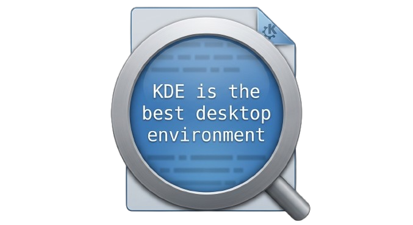

# KView

**KDE Fast File Previewer** - Quick preview for images, videos, audio, text, PDFs, and archives.



---

## Why You May Use This

1. **You lost your memory** and want to refresh your brain to know what files are here instantly
2. **You just want to preview file contents** for no reason
3. **You may use it for the same reason macOS users use Quick Look** (even though current Quick Look is a bloated app rather than just viewing the file)
4. **You love to use unmalicious software** from the internet

---

## What is KView?

**KView** = **K** (KDE) + **View** (Preview)

A lightweight, fast file previewer designed specifically for KDE Plasma. Right-click any file in Dolphin and select "KView Preview" for instant preview without opening the full application.

### Key Features

- **Dolphin Integration** - Right-click menu in KDE's file manager
- **Multi-Format Support** - Images, videos, audio, text, PDFs, archives
- **Frameless Preview** - Clean, borderless window that stays on top
- **Directory Navigation** - Browse through files in the same folder
- **Media Controls** - Play/pause and seek for video/audio
- **Archive Preview** - View contents of ZIP, TAR, 7Z files

---

## Supported Formats

| Category | Formats |
|----------|---------|
| **Images** | PNG, JPG, GIF, BMP, WEBP, SVG, etc. |
| **Video** | MP4, MKV, WEBM, AVI, etc. |
| **Audio** | MP3, WAV, OGG, FLAC, etc. |
| **Text** | TXT, MD, JSON, XML, code files, etc. |
| **Documents** | PDF |
| **Archives** | ZIP, TAR, 7Z |

---

## Installation

### Quick Install

1. Download `KView_KDE_linux.zip` from [Releases](https://github.com/HAKORADev/KView/releases)
2. Extract to your preferred location
3. Run the binary **once** to initialize:
   ```bash
   ./kview
   ```
4. Done! Right-click any file → **KView Preview**

### What Happens on First Run?

Running `./kview` without arguments sets up:
- Desktop entry (`~/.local/share/applications/kview.desktop`)
- Dolphin service menu (`~/.local/share/kio/servicemenus/kview.desktop`)
- Refreshes KDE's system database

---

## Usage

### Basic Usage

1. In Dolphin (KDE file manager), right-click any file
2. Select **KView Preview**
3. Preview opens instantly!

### Controls

| Key | Action |
|-----|--------|
| `Escape` | Close preview |
| `Enter` / `Return` | Open with default application |
| `←` Left Arrow | Previous file in folder |
| `→` Right Arrow | Next file in folder |
| `↑` Up Arrow | Scroll up |
| `↓` Down Arrow | Scroll down |
| `Space` | Play/Pause (video/audio) |
| `Q` | Seek backward 10% (video/audio) |
| `E` | Seek forward 10% (video/audio) |

---

## System Requirements

| Requirement | Details |
|-------------|---------|
| **OS** | Linux with KDE Plasma |
| **Qt** | 6.6.0 or higher |
| **KF6** | KDE Frameworks 6.0+ |
| **Display** | Wayland |

---

## Dependencies

KView requires these KDE Frameworks 6 components:
- KF6CoreAddons
- KF6I18n
- KF6KIO
- KF6Kirigami
- KF6Archive
- KF6FileMetaData

These are typically pre-installed on KDE Plasma 6 systems.

---

## Building from Source

```bash
# Clone repository
git clone https://github.com/HAKORADev/KView.git
cd KView

# Configure and build
cmake -B build
cmake --build build

# The binary will be at: build/kview
```

---

## Documentation

- **[CHANGELOG.md](CHANGELOG.md)** - Version history and changes

---

## License

Open-source software. See [LICENSE](LICENSE) for details.

---

## Links

- **Releases:** https://github.com/HAKORADev/KView/releases
- **Issues:** https://github.com/HAKORADev/KView/issues

---

<p align="center">
  <b>Made with 👁️ by HAKORA</b>
</p>
